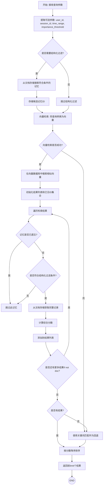

# episodic记忆类型的retrieve()逻辑

```mermaid
flowchart TD
    A[开始: 接收查询参数] --> B[提取可选参数: user_id, session_id, time_range, importance_threshold]
    B --> C{是否需要结构化过滤?}
    C --> |是| D[从文档存储搜索符合条件的记忆]
    D --> E[存储候选记忆ID]
    C --> |否| F[跳过结构化过滤]
    E --> G[向量检索: 将查询转换为向量]
    F --> G
    G --> H{向量检索是否成功?}
    H --> |是| I[在向量数据库中搜索相似向量]
    H --> |否| J[使用关键词匹配作为回退]
    I --> K[初始化结果列表和已见ID集合]
    K --> L[遍历检索结果]
    L --> M{记忆是否已遗忘?}
    M --> |是| N[跳过此记忆]
    M --> |否| O{是否符合结构化过滤条件?}
    O --> |否| N
    O --> |是| P[从文档存储获取完整记录]
    P --> Q[计算综合分数]
    Q --> R[添加到结果列表]
    R --> S{是否还有更多结果if not doc?}
    S --> |是| L
    S --> |否| T{是否有结果?}
    T --> |否| J
    T --> |是| U[按分数降序排序]
    J --> U
    U --> V[返回前limit个结果]
    V --> END(("END"))

```

